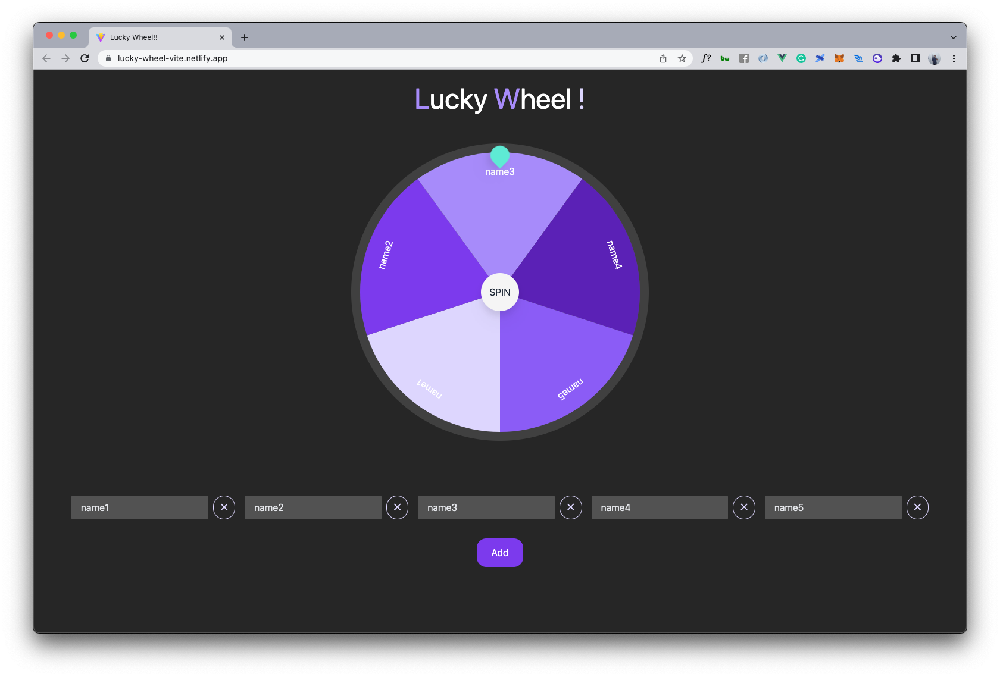

# Lucky Wheel

The frontend project for random the member in given list similar with roulette wheel.
It built from Vite.js and using Vue3 + Typescript.



## Command
- start dev server
    ```sh
    $ npm run dev
    ```
- build static for production
    ```sh
    $ npm run build
    ```
- check bundle files size
    ```sh
    $ sudo du -sh dist
    ```

[](https://app.netlify.com/sites/lucky-wheel-vite/deploys)